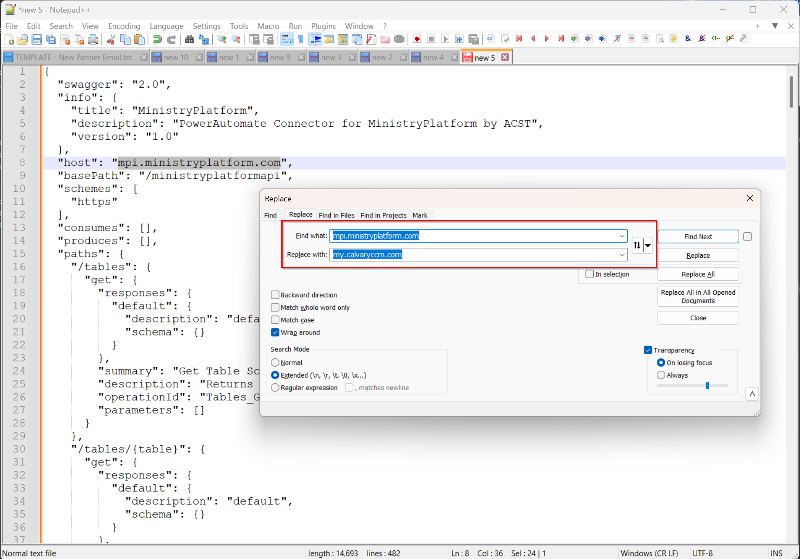
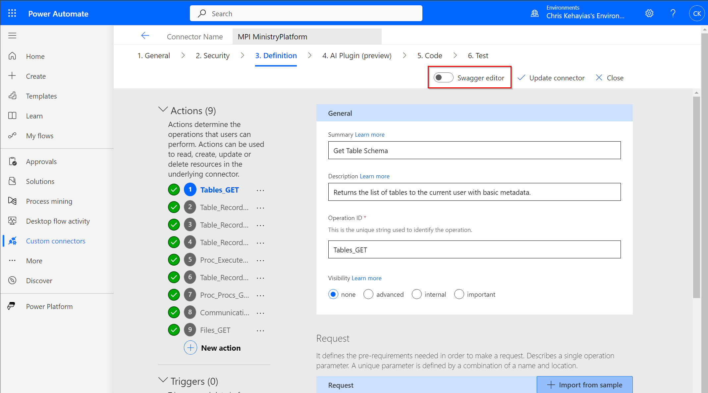
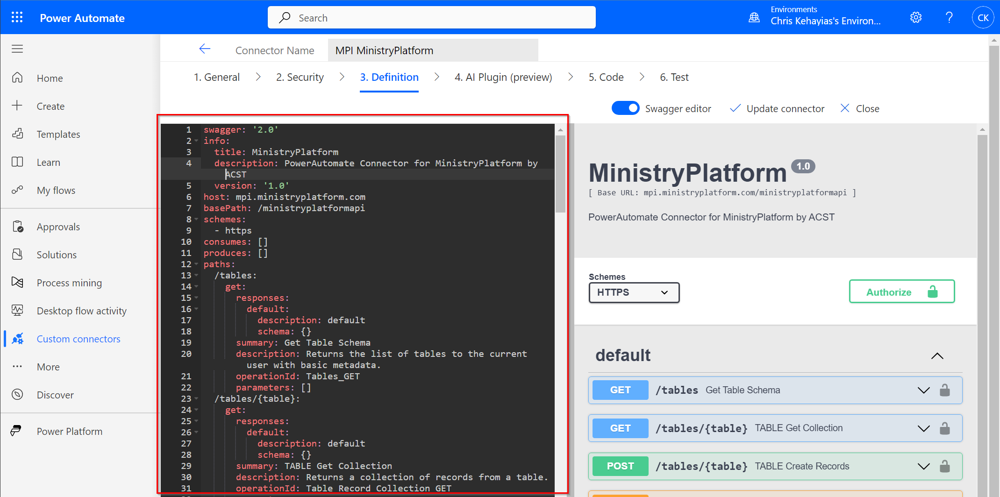
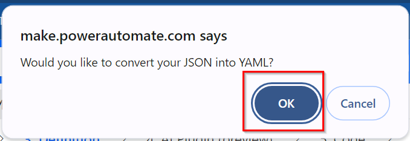
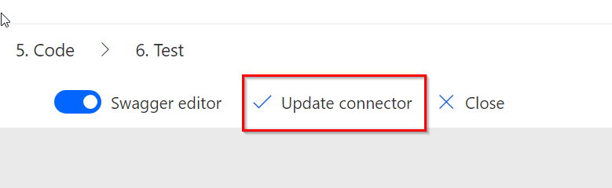

# PowerAutomate for MinistryPlatform

This project contains the MinistryPlatform Custom Connector that can be imported into PowerAutomate to enable simplified interactions between MinistryPlatform and PowerAutomate. Please note that all REST API endpoints are NOT available in this custom connector.

## MP Icon

If you want your custom connector to look really great, download the MinistryPlatform PowerAutomate Icon and upload it on your Custom Connector. This doesn't just look nice, it helps with quick identification of steps that are MP inside of a complex flow.

[Download MP Icon](Assets/MP-Logo-Icon.png)

## Setup MinistryPlatform for PowerAutomate

## Installation

## Update Custom Connector

You can update a MP Custom Connector with an updated definition by downloading the latest definition and then using that definition to do a quick update.

### Steps

- Download the Defintion from Github [Download Connector](Connector/MinistryPlatform.swagger.json)
- Open in some sort of text editor (VS Code, Notepad++, Notepad, etc)
- Search and Replace the Hostname (mpi.ministryplatform.com) with your hostname 
- Copy the updated JSON Definition
- Paste this definition into the Custom Connector Swagger Editor  
- Click the OK Button to convert JSON to YAML 
- Make sure you click the Update Connector Button ensure the changes are saved 
- All Finished...Your Connector should be up to date

## Release History

- 2024.3.22
  - Updated Connector to provide Common Tables as dropdown
  - Added Utility - Get Table List as example of how create list of table schema from MP
- 2024.3.21
  - Updated SMS Test PowerAutomate Example
  - Updated Email Test PowerAutomate Example
- 2024.3.6
  - Corrected the Execute Stored Procedure Endpoint
  - Updated most of the connector
    - Adding Summaries, Descriptions, Help
  - Added Stored Procedure Example Flow
- 2024.2.26
  - Added Text Support to Communications Endpoint
  - Added GitHub Repository and Custom Connector
